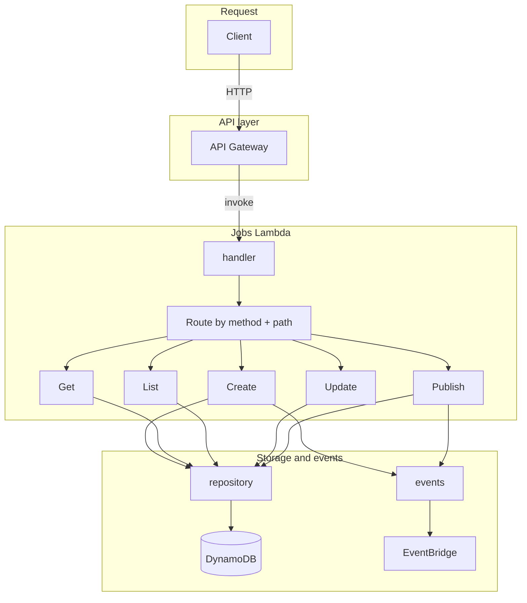
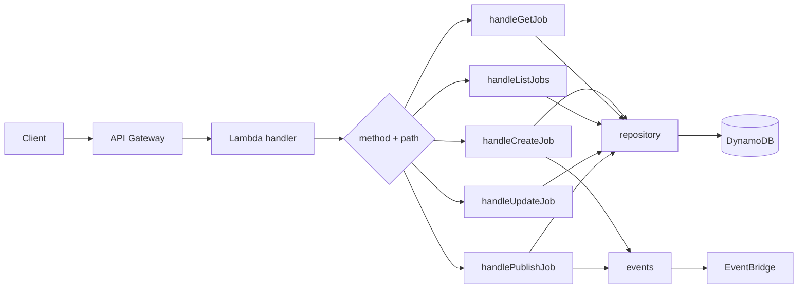
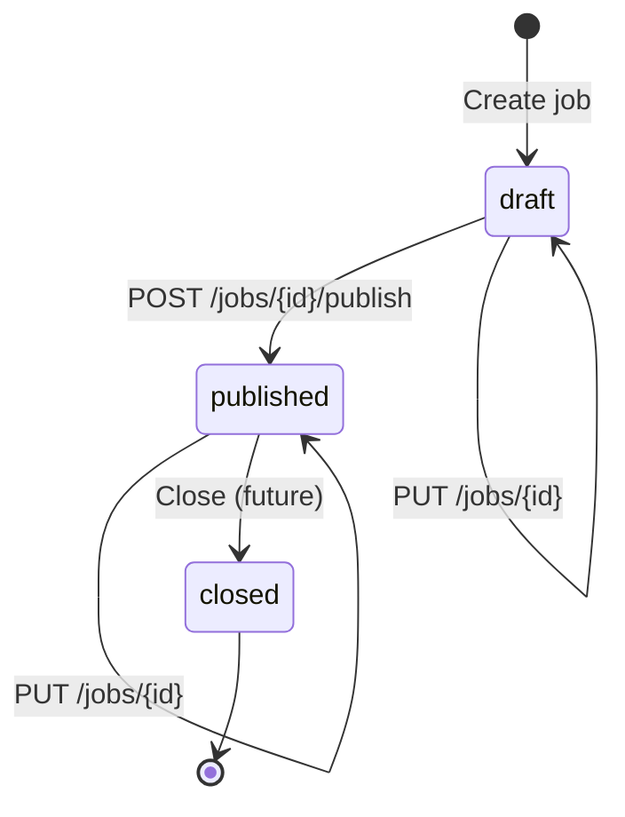

# Jobs service

The jobs service owns the **Job** aggregate for the gig platform: creating, updating, listing, and publishing jobs (e.g. landscaping, handyman). It runs on **AWS Lambda** and **DynamoDB**, and publishes domain events to **EventBridge**.

---

## How it works

**End-to-end: one request through the jobs service**



1. **Client** sends HTTP (e.g. `POST /jobs`, `GET /jobs/{id}`) to **API Gateway**.
2. **API Gateway** invokes the **Jobs Lambda** (one function for all routes).
3. **Lambda** runs the **handler**, which **routes** on method and path to the right action (Create, Get, List, Update, Publish).
4. The action uses **repository** (read/write **DynamoDB**) and, for Create and Publish, **events** (publish to **EventBridge**).
5. Lambda returns the HTTP response to the client.

**Request flow (detail)**



1. **API Gateway** receives HTTP requests and invokes a single **Lambda** function.
2. The handler routes by method and path to the right action (create, get, list, update, publish).
3. **DynamoDB** stores jobs; the table is keyed by `jobId` with GSIs for listing by status and by client.
4. After state changes, the service publishes events to **EventBridge** (e.g. `job.created`, `job.published`) so other services can react without being called directly.

No JWT auth is enforced in this service yet; `clientId` can be sent in the create body or defaults to `"anonymous"`.

---

## Job lifecycle



| Status     | Meaning |
|-----------|---------|
| **draft** | Newly created; not visible in default list. Can be updated or published. |
| **published** | Visible to workers; can be updated (e.g. schedule); can be closed. |
| **closed** | No longer available; cannot be updated or published. |

- **Create** → job is created in `draft`.
- **Publish** (`POST /jobs/{id}/publish`) → draft moves to `published`; `job.published` event is sent.
- **Close** → (not yet exposed by API; can be added) moves to `closed`; `job.closed` event can be sent.

---

## API

Base path: `/jobs`. All responses are JSON.

### Create job

**`POST /jobs`**

Body:

```json
{
  "title": "Mow lawn",
  "categoryId": "landscaping",
  "location": "Seattle, WA",
  "description": "Small front yard",
  "budget": "50",
  "scheduledAt": "2025-03-01T10:00:00Z",
  "clientId": "optional-user-id"
}
```

- `clientId` is optional; if omitted, `"anonymous"` is used.
- Returns `201` with the full job (including `jobId`, `status: "draft"`, `createdAt`, `updatedAt`).
- Publishes `job.created` to EventBridge.

### Get job

**`GET /jobs/{id}`**

- Returns `200` with the job or `404` if not found.

### List jobs

**`GET /jobs`**

Query parameters:

| Parameter | Description |
|-----------|-------------|
| `status` | `draft`, `published`, or `closed`. Default `published`. |
| `category` | Filter by `categoryId`. |
| `location` | Substring match on `location` (case-insensitive). |
| `limit` | Page size 1–100; default 20. |
| `cursor` | Opaque token for next page. |

Returns `200` with `{ "items": [...], "nextCursor": "..." }`.

### Update job

**`PUT /jobs/{id}`**

Body: any subset of `title`, `categoryId`, `location`, `description`, `budget`, `scheduledAt`.

- Only jobs in `draft` or `published` can be updated; `closed` returns `409`.
- Returns `200` with the updated job or `404`.

### Publish job

**`POST /jobs/{id}/publish`**

- Job must be in `draft`; otherwise `409`.
- Sets status to `published`, publishes `job.published` to EventBridge, returns `200` with the job.

---

## Events (EventBridge)

The service publishes events that follow the shared [event contract](../../../docs/05-event-contracts.md): envelope with `eventId`, `eventType`, `eventVersion`, `correlationId`, `timestamp`, `producer`, `payload`.

| Event type     | When | Payload |
|----------------|------|---------|
| `job.created`  | A job is created (draft). | `jobId`, `clientId`, `categoryId`, `location`, `status` |
| `job.published`| A draft is published. | `jobId`, `clientId` |
| `job.closed`   | (Reserved for future) Job is closed. | `jobId`, `reason` (optional) |

Consumers (e.g. notifications, search) can subscribe to these on the default EventBridge bus.

---

## Data model (DynamoDB)

- **Table**: `gig-platform-jobs` (name set in Terraform).
- **Partition key**: `jobId` (string, UUID).
- **Attributes**: `clientId`, `title`, `categoryId`, `location`, `description`, `budget`, `scheduledAt`, `status`, `createdAt`, `updatedAt`, and optionally `closedReason` for closed jobs.

**GSIs:**

- **status-createdAt-index** — partition key `status`, sort key `createdAt`. Used to list jobs by status (e.g. all published jobs, newest first).
- **clientId-createdAt-index** — partition key `clientId`, sort key `createdAt`. Used to list “my jobs” by client.

List endpoint uses the status GSI and optionally filters in-app by `category` and `location`.

---

## Code layout

| Path | Role |
|------|------|
| `src/index.ts` | Lambda handler; routing and HTTP/validation. |
| `src/repository.ts` | DynamoDB read/write (create, get, update, list, update status). |
| `src/events.ts` | EventBridge publish (job.created, job.published, job.closed). |
| `src/types.ts` | Job and input/query types. |

Environment variables (set by Terraform):

- `TABLE_NAME` — DynamoDB table name.
- `EVENT_BUS_NAME` — EventBridge bus name (e.g. `default`).

---

## Build and deploy

- **Build**: From repo root, `yarn build` (workspaces), or from `app/services/jobs`: `yarn build`. Output is `dist/`.
- **Lambda package**: From `app/services/jobs`, `yarn build:lambda`. Produces `build/package/` (Terraform zips it for the Lambda).
- **Deploy**: From repo root, `yarn deploy` (runs jobs build:lambda then terraform apply). See [infra/README.md](../../../infra/README.md).

---

## Related docs

- [API contracts](../../docs/04-api-contracts.md) — platform-wide API shape.
- [Event contracts](../../docs/05-event-contracts.md) — event envelope and event types.
- [Service catalog](../../docs/03-service-catalog.md) — jobs service boundaries and ownership.
