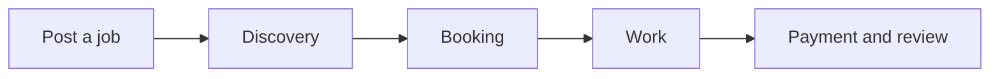
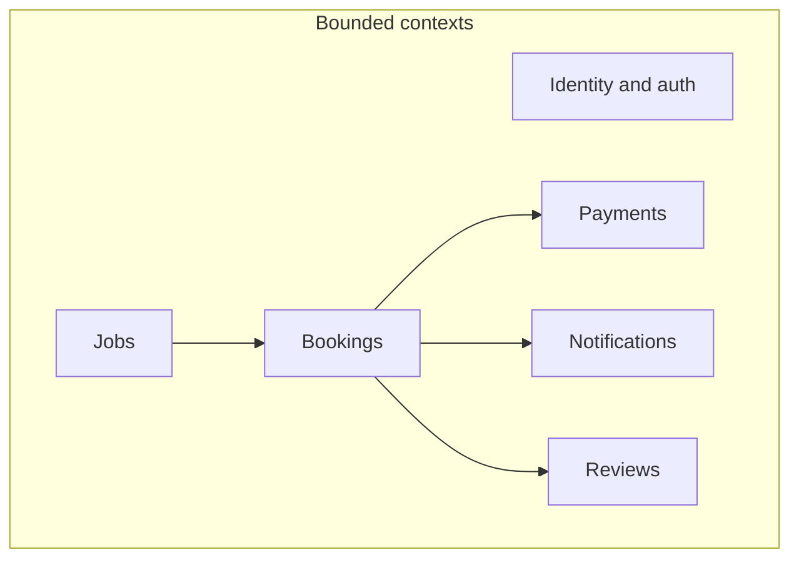

# Product and domain

## Problem and goals

**Problem**: People who need small, local jobs done (e.g. landscaping, moving help, handyman tasks) often struggle to find reliable workers. Workers who do these jobs lack a simple way to find and get paid for gigs.

**Goals**:

- Connect people who need work done with people who do the work. **Any account can post a job and act as a worker**; there is no separate "client" vs "worker" role or worker-only service.
- Make posting a job, finding a worker, and completing a booking simple and trustworthy.
- Enable clear pricing, scheduling, and payment in one place.

**Success criteria** (to be refined):

- Clients can post a job and receive qualified worker interest or matches.
- Workers can discover jobs, accept bookings, and get paid.
- Bookings have a clear lifecycle (requested → confirmed → in progress → completed).
- Payments are held and released appropriately; disputes can be escalated.

---

## User personas

| Persona       | Description |
|---------------|-------------|
| **User**      | Any registered user. Can post jobs (e.g. homeowner needing lawn care) and can also perform gigs (e.g. landscaper). No separate client/worker sign-up or worker profile service. |
| **Admin**     | (Optional) Platform operator for support, disputes, and moderation. |

---

## Core flows

### Happy path

1. **Post a job** — Any user creates a job (category e.g. landscaping, location, description, budget, preferred schedule).
2. **Discovery** — Users see the job (browse or match); they can apply or be invited.
3. **Booking** — Job poster selects a gig provider (or they accept); booking is created and confirmed.
4. **Work** — Gig provider performs the job; status moves to in progress, then completed.
5. **Payment & review** — Payment is released (or was held and is released); both sides can leave ratings/reviews.

### Key alternatives

- **Cancel** — Client or worker cancels before or after confirmation; policy for refunds/cancellation fees to be defined.
- **Reschedule** — Client or worker requests a new date/time; booking stays linked.
- **Dispute** — Issue with completion or payment; escalation path (e.g. admin, support) to be defined.

---

## Bounded contexts

Domains that will map to services or subsystems:

| Context            | Responsibility |
|--------------------|----------------|
| **Identity & auth**| Who you are; registration, login. No client/worker role; any user can post jobs and take gigs. |
| **Jobs**           | Job creation, categories (e.g. landscaping), location, budget, schedule, draft/published. |
| **Bookings**       | Matching/assigning a gig provider to a job; status lifecycle (requested, confirmed, in progress, completed, cancelled). |
| **Payments**       | Holds, release, refunds, payouts. |
| **Notifications**  | In-app and/or email/SMS for status changes and reminders. |
| **Reviews**        | Ratings and feedback after a job. |

This gives a shared language and scope before touching AWS or code.
