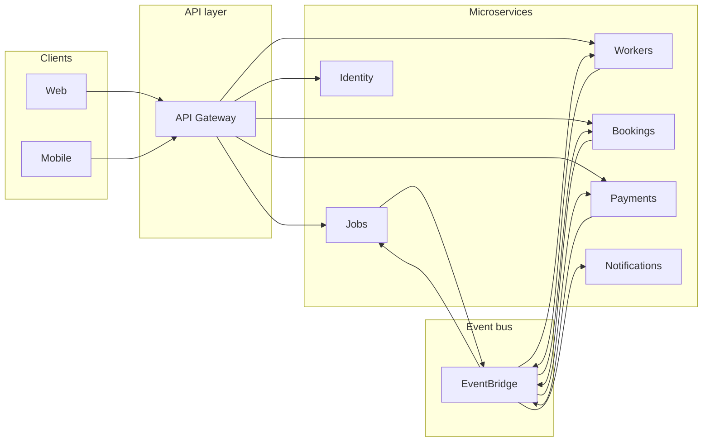
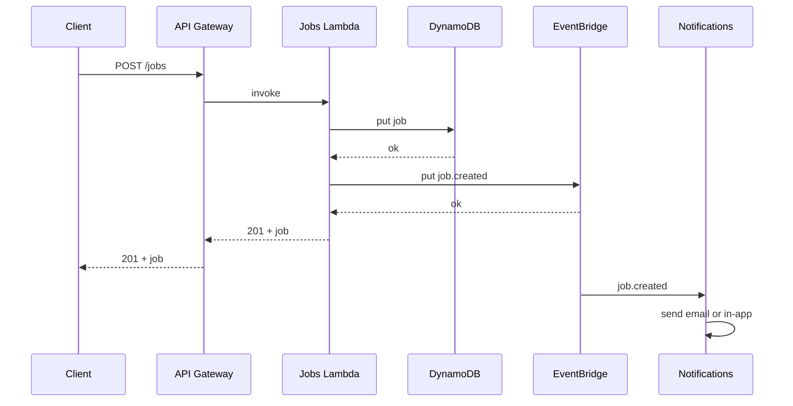

# Architecture overview

## High-level design

Clients (web/mobile) call an API layer; the API layer talks to microservices. Services own their data and communicate via **synchronous APIs** (request/response) and **asynchronous events** (domain events). There is no shared database across services.

### Create-job flow (sequence)

---

## Decoupling strategy

### Synchronous (request/response)

- **API Gateway** (REST or HTTP API) fronts all client-facing APIs.
- Backed by **Lambda** and/or **containerized APIs** (e.g. ECS/Fargate).
- Use for: get job details, create booking, get worker profile, auth.
- Keep payloads and responses within service boundaries; call other services via their APIs when needed (or use events to avoid blocking).

### Asynchronous (events)

- **EventBridge** (recommended) or SNS/SQS for domain events.
- Events such as: `JobCreated`, `BookingConfirmed`, `PaymentCompleted`, `JobCompleted`.
- Producers publish after persisting their own state; consumers handle events idempotently.
- Use events for: notifying other services, triggering notifications, updating read models or caches, audit.

---

## AWS services

| Area          | Services |
|---------------|----------|
| **Compute**   | Lambda, ECS/Fargate (or both). |
| **API**       | API Gateway (REST or HTTP API). |
| **Events**    | EventBridge; optionally SQS for queues. |
| **Data**      | RDS and/or DynamoDB per service; no shared DB. |
| **Auth**      | Cognito (user pools; optional identity pool for direct AWS access). |
| **Storage**   | S3 for assets (e.g. job photos, documents). |
| **Observability** | CloudWatch (logs, metrics); X-Ray if needed. |

---

## Deployment

- Single repo or monorepo with multiple deployable units (one per service or per bounded context).
- CI/CD via CDK, CloudFormation, SAM, or similar; exact tool to be specified later.
- Each service is deployable and testable in isolation.
