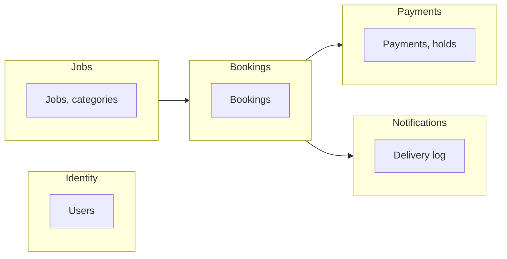

# Service catalog and boundaries

Each service (or bounded context) owns its data, exposes APIs and/or consumes events, and uses its own storage. No shared databases.

---

## Identity

| Aspect      | Detail |
|------------|--------|
| **Name**   | identity (or auth) |
| **Owns**   | User identity, auth tokens/sessions. No client/worker role; any user can post jobs and take gigs. |
| **Inbound**| API: sign-up, sign-in, token refresh; Cognito triggers if used. |
| **Outbound**| Events: `UserRegistered` (if needed). APIs: none. |
| **Storage**| Cognito user pool. |

---

## Jobs

| Aspect      | Detail |
|------------|--------|
| **Name**   | jobs-service |
| **Owns**   | Job aggregate: title, category, location, description, budget, schedule, status (draft/published/closed). |
| **Inbound**| API: create/update/list/get job. Events: none required for core flow. |
| **Outbound**| Events: `JobCreated`, `JobPublished`, `JobClosed`. |
| **Storage**| DynamoDB or RDS; table(s) for jobs, categories. |

---

## Bookings

| Aspect      | Detail |
|------------|--------|
| **Name**   | bookings-service |
| **Owns**   | Booking: job reference, worker reference, status (requested, confirmed, in progress, completed, cancelled), timestamps. |
| **Inbound**| API: create booking, accept/cancel, update status. Events: `JobCreated` (optional for indexing), `PaymentCompleted` (mark paid). |
| **Outbound**| Events: `BookingCreated`, `BookingConfirmed`, `BookingCompleted`, `BookingCancelled`. |
| **Storage**| DynamoDB or RDS; table(s) for bookings. |

---

## Payments

| Aspect      | Detail |
|------------|--------|
| **Name**   | payments-service |
| **Owns**   | Payment intent, hold, release, refund, payout; link to booking. |
| **Inbound**| API: create hold, release, refund. Events: `BookingConfirmed` (create hold), `BookingCompleted` (release). |
| **Outbound**| Events: `PaymentHoldCreated`, `PaymentCompleted`, `PaymentRefunded`. |
| **Storage**| RDS or DynamoDB; table(s) for payments; integrate with payment provider (Stripe, etc.). |

---

## Notifications

| Aspect      | Detail |
|------------|--------|
| **Name**   | notifications-service |
| **Owns**   | Delivery state (sent/failed); templates and channels (email, SMS, in-app). |
| **Inbound**| Events: `JobCreated`, `BookingConfirmed`, `BookingCompleted`, etc. |
| **Outbound**| None (side-effect service). |
| **Storage**| Optional: DynamoDB for delivery log or preference store. |

---

## Reviews (optional separate service)

| Aspect      | Detail |
|------------|--------|
| **Name**   | reviews-service |
| **Owns**   | Review aggregate: rating, text, reviewer, reviewee, booking reference. |
| **Inbound**| API: submit review, list reviews for worker/job. Events: `BookingCompleted` (allow review). |
| **Outbound**| Events: `ReviewSubmitted` (e.g. to update aggregate ratings). |
| **Storage**| DynamoDB or RDS. |

---

Keep each service deployable and testable in isolation; avoid shared databases.
