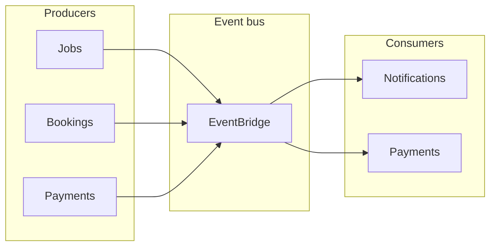

# Event contracts

Domain events are published to EventBridge (or chosen event bus). Consumers must handle **at-least-once** delivery and process events **idempotently**.

---

## Event envelope (all events)

Every event payload must include:

| Field           | Type   | Description |
|-----------------|--------|-------------|
| `eventId`       | string | Unique ID for this event occurrence (e.g. UUID). |
| `eventType`     | string | Event name (e.g. `job.created`). |
| `eventVersion`  | string | Schema version (e.g. `"1.0"`). |
| `correlationId` | string | Request/correlation ID for tracing. |
| `timestamp`     | string | ISO 8601 UTC. |
| `producer`      | string | Service name (e.g. `jobs-service`). |
| `payload`       | object | Event-specific data. |

---

## Events by producer

### jobs-service

| Event type     | When | Payload (main fields) |
|----------------|------|------------------------|
| `job.created`  | Job created (draft or published). | `jobId` (UUID), `clientId`, `categoryId`, `location`, `status`. |
| `job.published`| Job moved to published. | `jobId`, `clientId`. |
| `job.closed`   | Job closed. | `jobId`, `reason` (optional). |

### bookings-service

| Event type           | When | Payload (main fields) |
|----------------------|------|------------------------|
| `booking.created`    | Booking created. | `bookingId`, `jobId`, `workerId`, `clientId`, `status`. |
| `booking.confirmed`  | Booking confirmed. | `bookingId`, `jobId`, `workerId`, `clientId`, `scheduledAt`. |
| `booking.completed` | Booking marked completed. | `bookingId`, `jobId`, `workerId`, `clientId`, `completedAt`. |
| `booking.cancelled`  | Booking cancelled. | `bookingId`, `jobId`, `reason`, `cancelledBy`. |

### payments-service

| Event type            | When | Payload (main fields) |
|-----------------------|------|------------------------|
| `payment.hold.created`| Hold created for booking. | `paymentId`, `bookingId`, `amount`, `currency`. |
| `payment.completed`   | Payment released to worker. | `paymentId`, `bookingId`, `amount`. |
| `payment.refunded`    | Refund processed. | `paymentId`, `bookingId`, `amount`, `reason`. |

---

## Consumers (intended)

| Event type(s) | Consumer | Action |
|---------------|----------|--------|
| `job.created`, `job.published` | notifications-service | Notify job poster or interested users. |
| `booking.created`, `booking.confirmed`, `booking.completed`, `booking.cancelled` | notifications-service | Send status emails/SMS. |
| `booking.confirmed` | payments-service | Create hold. |
| `booking.completed` | payments-service | Release payment. |
| `booking.cancelled` | payments-service | Refund/cancel hold as per policy. |
| `booking.completed` | reviews-service | Allow submitting review. |
| `review.submitted` | (optional) | Update aggregate rating if a reviews/ratings service exists. |

---

## Idempotent handling

- Consumers must use `eventId` (and optionally `eventType` + aggregate ID) to deduplicate.
- Store processed `eventId`s in a table or cache with TTL; skip processing if already seen.
- On duplicate delivery, return success (or no-op) and do not change state again.
